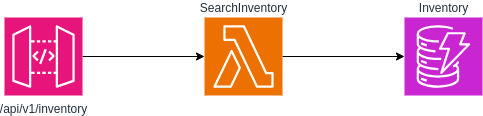
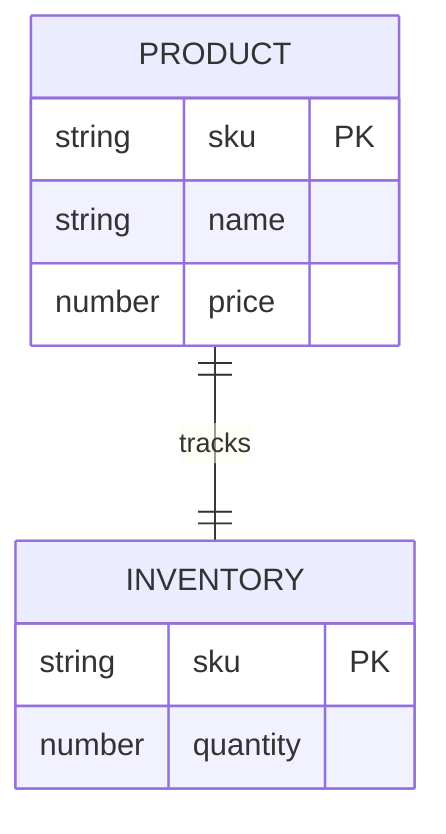
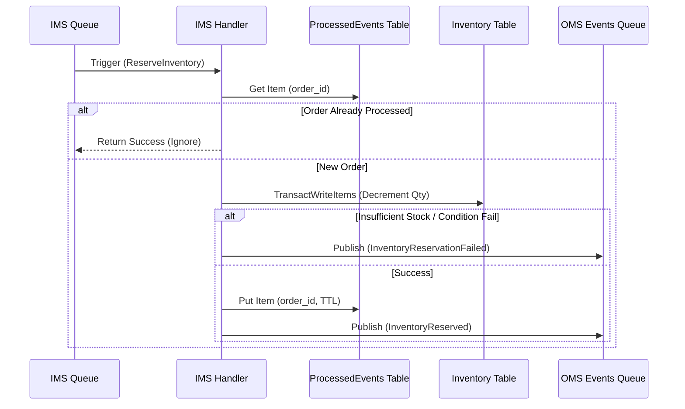
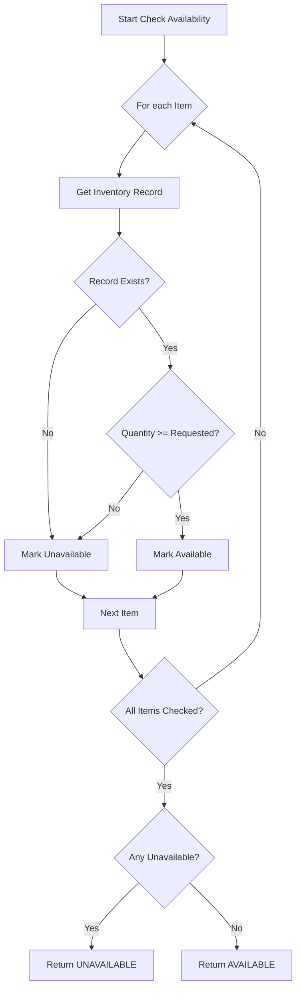

# Inventory Management System (IMS)



## Managing Inventory

Users shall be able to list the inventory, and find the inventory by SKU.

## System Diagrams

### Entity Relationship Diagram



### IMS Reservation Logic



### Inventory Check Flowchart



## Data Model

### Product Table (`ProductTable`)

- **Primary Key**: `sku` (String)

**Attributes**:

- `sku`: SKU (String)
- `name`: String
- `description`: String
- `price`: Number
- `image_url`: String
- `created_at`: String (ISO 8601)
- `updated_at`: String (ISO 8601)

### Inventory Table (`InventoryTable`)

- **Primary Key**: `sku` (String)

**Attributes**:

- `sku`: SKU (String)
- `quantity`: Number
- `updated_at`: String (ISO 8601)

### Processed Events Table (`ProcessedEventsTable`)

- **Primary Key**: `order_id` (String)
- **TTL Attribute**: `ttl` (Number, Unix Timestamp)

**Attributes**:

- `order_id`: Order ID (String)
- `ttl`: Expiration timestamp
- `created_at`: String (ISO 8601)

## Operations & API Specification

### Create Product

**Endpoint**: `POST /products`
**Request Body**:

```json
{
  "sku": "string",
  "name": "string",
  "description": "string",
  "price": 10.99,
  "image_url": "string"
}
```

**Logic**:

1. Create item in `ProductTable`.
2. Create item in `InventoryTable` with `quantity: 0`.

### Get Product

**Endpoint**: `GET /products/{sku}`
**Logic**:

1. Get Product details from `ProductTable`.
2. Get Quantity from `InventoryTable`.
3. Return combined result.

### List Products (Inventory)

**Endpoint**: `GET /products`
**Query Parameters**:

- `limit` (Optional)
- `next_token` (Optional)
  **Logic**: Scan `ProductTable` (with pagination). Optionally fetch inventory levels if needed, or keep them separate.

### Find Inventory by SKU

**Endpoint**: `GET /inventory/{sku}`
**Logic**: Get item by PK from `InventoryTable`.

### Check Inventory Availability

**Endpoint**: `POST /inventory/check`
**Request Body**:

```json
{
  "items": [{ "sku": "string", "quantity": 1 }]
}
```

**Logic**: BatchGetItem or parallel GetItem to check availability. Return map of available/unavailable.

## Messaging Contracts

### OMS -> IMS (Reserve Inventory)

**Queue**: `IMS-InventoryQueue`
**Message Body**:

```json
{
  "type": "ReserveInventory",
  "order_id": "uuid",
  "customer_id": "string",
  "items": [{ "sku": "string", "quantity": 1 }],
  "timestamp": "iso-date"
}
```

### IMS Handler Logic (Reserve Inventory)

1. **Idempotency Check**: Check if `order_id` processed in `ProcessedEventsTable` (or similar mechanism).
2. **Transaction**:
   - TransactWriteItems to decrement quantity for all items.
   - Condition: `quantity >= requested_quantity`.
3. **On Success**:
   - Send `InventoryReserved` event to `OMS-OrderEventsQueue`.
4. **On Failure** (Insufficient stock or SKU not found):
   - Send `InventoryReservationFailed` event to `OMS-OrderEventsQueue`.

## AWS Services Configuration

### DynamoDB

- Billing Mode: On-Demand
- Encryption: AWS Managed Key

### API Gateway

- Type: REST API
- Auth: Custom Lambda Authorizer

### SQS

- **IMS-InventoryQueue**: Standard Queue.
- **IMS-InventoryDLQ**: Dead Letter Queue for the Inventory Queue.
- **OMS-OrderEventsQueue**: Referenced only (Created by OMS).

### Lambda

- Runtime: Node.js 22.x
- Architecture: arm64
- Environment Variables:
  - `INVENTORY_TABLE_NAME`
  - `PRODUCT_TABLE_NAME`
  - `OMS_EVENTS_QUEUE_URL`
