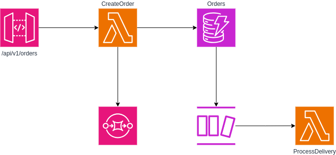
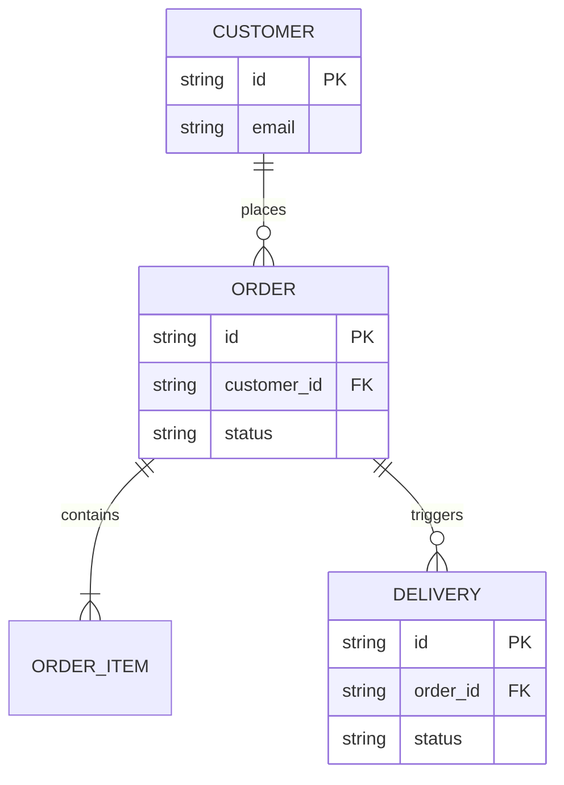
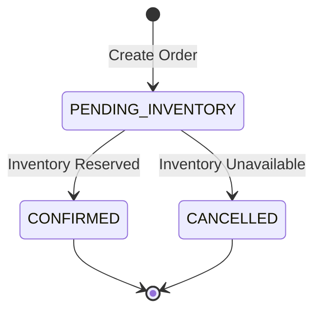
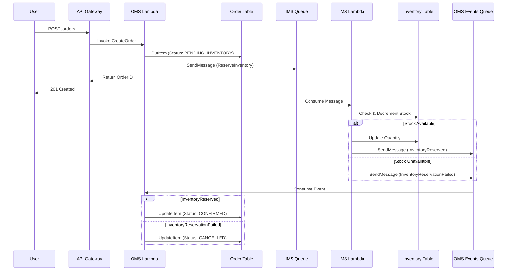

# Order Management System (OMS)



## Managing Orders

Users shall be able to create, list and delete orders.
In order to interact with the system, the user must provide a valid API key.

## System Diagrams

### Entity Relationship Diagram



### Order State Machine



### Create Order Flow



## Data Model

The system shall use DynamoDB. To ensure scalability and support the required access patterns, we will use the following schema designs.

### Order Table (`OrderTable`)

- **Primary Key**: `id` (String)
- **GSI1 (By Customer)**:
  - Partition Key: `customer_id` (String)
  - Sort Key: `created_at` (String, ISO 8601)
  - _Purpose_: List orders by customer, sorted by date.
- **GSI2 (By Status)**:
  - Partition Key: `status` (String)
  - Sort Key: `created_at` (String, ISO 8601)
  - _Purpose_: List orders by status.

**Attributes**:

- `id`: Order ID (UUID)
- `customer_id`: Customer ID
- `items`: List of maps `[{sku, quantity, price, name}]`
- `total`: Number
- `status`: String (`PENDING_INVENTORY`, `CONFIRMED`, `CANCELLED`)
- `created_at`: String (ISO 8601)
- `updated_at`: String (ISO 8601)

### Customer Table (`CustomerTable`)

- **Primary Key**: `id` (String)

**Attributes**:

- `id`: Customer ID
- `name`: String
- `email`: String
- `address`: String

### Delivery Table (`DeliveryTable`)

- **Primary Key**: `id` (String)
- **GSI1**: `order_id` (Partition Key)

## Operations & API Specification

The API must be exposed via API Gateway.

### Create Order

**Endpoint**: `POST /orders`
**Request Body**:

```json
{
  "customer_id": "string",
  "items": [{ "sku": "string", "quantity": 1 }]
}
```

**Logic**:

1. Validate `customer_id` exists in `CustomerTable`.
2. Create Order in `OrderTable` with status `PENDING_INVENTORY`.
3. Send `ReserveInventory` message to IMS SQS.
4. Return `201 Created` with `{ "order_id": "..." }`.

### List Orders

**Endpoint**: `GET /orders`
**Query Parameters**:

- `customer_id` (Required)
- `status` (Optional)
- `start_date` (Optional, ISO 8601)
- `end_date` (Optional, ISO 8601)

**Logic**:

- Use `GSI1` to query by `customer_id`.
- Apply filter expressions for `status` or date range if provided.
- Implement pagination (Limit/NextToken).

### Get Order

**Endpoint**: `GET /orders/{id}`
**Logic**: Get item by PK from `OrderTable`.

### Delete Order

**Endpoint**: `DELETE /orders/{id}`
**Logic**: Delete item by PK from `OrderTable`.

## Messaging Contracts

### OMS -> IMS (Reserve Inventory)

**Queue**: `IMS-InventoryQueue`
**Message Body**:

```json
{
  "type": "ReserveInventory",
  "order_id": "uuid",
  "customer_id": "string",
  "items": [{ "sku": "string", "quantity": 1 }],
  "timestamp": "iso-date"
}
```

### IMS -> OMS (Reservation Result)

**Queue**: `OMS-OrderEventsQueue`
**Message Body**:

```json
{
  "type": "InventoryReserved" | "InventoryReservationFailed",
  "order_id": "uuid",
  "reason": "string (optional)"
}
```

**OMS Handler Logic**:

- On `InventoryReserved`: Update Order status to `CONFIRMED`.
- On `InventoryReservationFailed`: Update Order status to `CANCELLED`.

## AWS Services Configuration

### DynamoDB

- Billing Mode: On-Demand
- Encryption: AWS Managed Key
- Stream: Enabled (New and Old Images) for `OrderTable`.

### API Gateway

- Type: REST API
- Auth: Custom Lambda Authorizer
- Stages: `dev`, `prod`

### SQS

- **OMS-OrderEventsQueue**: Standard Queue.
- **OMS-OrderEventsDLQ**: Dead Letter Queue for the Order Events Queue.
- **IMS-InventoryQueue**: Referenced only (Created by IMS).

### Lambda

- Runtime: Node.js 22.x
- Architecture: arm64
- Environment Variables:
  - `ORDER_TABLE_NAME`
  - `CUSTOMER_TABLE_NAME`
  - `IMS_QUEUE_URL`
